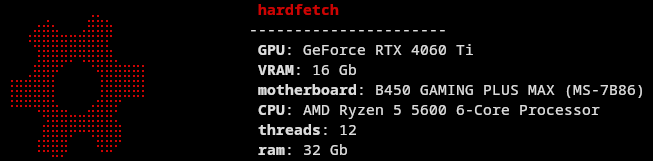

# Persistent Tree
  

Hardfetch is a minimalist system information tool inspired by neofetch. It displays essential hardware details along with a red ASCII art symbol. It's designed for quick system diagnostics or showcasing hardware in a visually appealing way.


## Features
- Displays detailed hardware information:
    - GPU: Graphics card name (e.g., "GeForce RTX 4060 Ti").
    - VRAM: Video memory in gigabytes.
    - Motherboard: Product name of the motherboard.
    - CPU: Processor model name.
    - Threads: Total number of CPU threads.
    - RAM: Total system memory in gigabytes.
- Outputs the information alongside ASCII art for aesthetics.
  
  
## Example Output 📢


## Requirements
- Linux system (tested on distributions like Arch Linux).
- Administrative privileges (sudo) for some commands.
- Shell environment with support for ANSI escape codes (e.g., Bash).

## Installation ⚙️

To run this program on your machine, follow these steps:

1. **Clone the repository**:  
   ```git clone https://github.com/mzums/hardfetch```
2. **Navigate to the project directory**:  
    ```cd hardfetch```
3. **Make the script executable**:  
    ```chmod +x hardfetch.sh```
4. **Run the script**:
    ```./hardfetch.sh```

## Contributing 🖋️
Contributing is always welcome!  
Steps to contribute:
1. Fork the repository.
2. Create a new branch  
    ```git checkout -b feature/your-feature```
3. Make your changes and commit them.  
    ```git commit -am 'Add new feature'```
4. Push to your branch.  
    ```git push origin feature/your-feature```
5. Create a new Pull Request.